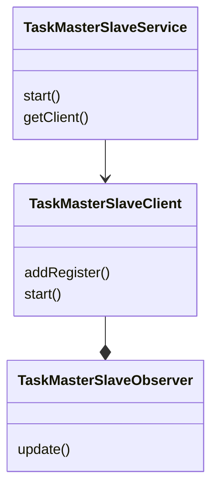

### 通用服務元件

為提升開發速度，提供常用元件設計開放設計，

### 目前提供功能

* 任務拆分 IGroupTaskService

### CHANGELOG

- 0.0.1  加入任務拆分
- 0.0.2  修改中斷方式，不強制中斷採取
- 0.0.3  TaskOverTimeService服務，超過執行數量增加額外Wokr輔助
- 0.0.4  加入關閉timeout機制
- 0.0.5  加入OrderQueue減少資料重複同時執行




```java

/**
 * 任務主從服務測試
 */
class TaskMasterSlaveServiceTest {


    private TaskMasterSlaveService service = new TaskMasterSlaveService(1,
            1, //
            3);

    /**
     * 未啟動Slave
     */
    @Test
    void testMaster() {
        SpyTask task = Mockito.spy(new SpyTask());

        List<Long> longs = Arrays.asList(1l, 1l, 1l, 1l);
        service.start(task, longs);
    }
}
```

```java


/**
 * 任務拆分服務
 */
public interface IGroupTaskService {

    /**
     * 任務執行
     * @param groupTaskOption
     * @param <T>
     */
    <T> void execute(GroupTaskOption<T> groupTaskOption);


    interface IGroupTask<T> {
        void run(List<T> tasks);
    }
}

void test() {

    GroupTaskService groupTaskService = new GroupTaskService();
    GroupTaskOption.GroupTaskOptionBuilder<Integer> groupTaskOptionBuilder = new GroupTaskOption.GroupTaskOptionBuilder();
    GroupTaskOption<Integer> input = groupTaskOptionBuilder
            .name("test")//
            .threadSize(threadSize)//
            .groupSize(groupSize)//
            .task(run)//
            .tasks(collect)//
            .build();
    groupTaskService.execute(input);
}
```
